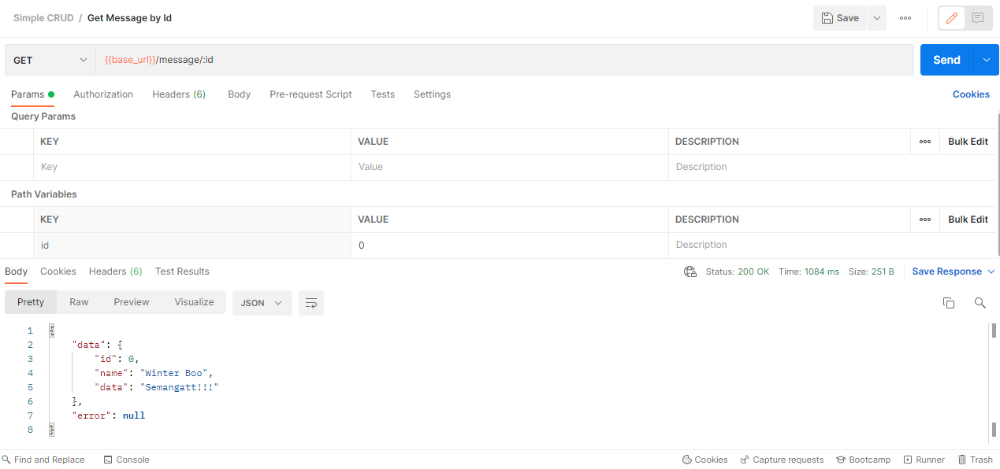

# CRUD - Message API

## Deployment

[https://law-message-api.herokuapp.com](https://law-message-api.herokuapp.com)

## Endpoint

1. **GET** `{{base_url}}/message/list`

    

2. **GET** `{{base_url}}/message/:id`

    * Path Variables:
        | Key | Type   | Required? |
        | --- | ------ | --------- |
        | id  | Number | yes       |

    

3. **POST** `{{base_url}}/message/create`

    * Content-type:
        * multipart/form-data
    * Request Body:
        | Key      | Type   | Required? |
        | -------- | ------ | --------- |
        | name     | String | yes       |
        | password | String | yes       |
        | data     | String | yes       |

    

4. **PUT** `{{base_url}}/message/:id`

    * Path Variables:
        | Key | Type   | Required? |
        | --- | ------ | --------- |
        | id  | Number | yes       |
    * Content-type:
        * multipart/form-data
    * Request Body:
        | Key      | Type   | Required? |
        | -------- | ------ | --------- |
        | name     | String | yes       |
        | password | String | yes       |
        | data     | String | yes       |

    

5. **DELETE** `{{base_url}}/message/:id`

    * Path Variables:
        | Key | Type   | Required? |
        | --- | ------ | --------- |
        | id  | Number | yes       |
    * Request Headers:
        | Key           | Value                | Required? |
        | ------------- | -------------------- | --------- |
        | Authorization | <message's password> | yes       |

    

## How to Run (Local Windows)

Download [simple-crud.exe](./simple-crud.exe) and run it 🎉

## Postman Collection

[Message API's Postman Collection](./example/Simple%20CRUD.postman_collection.json)
